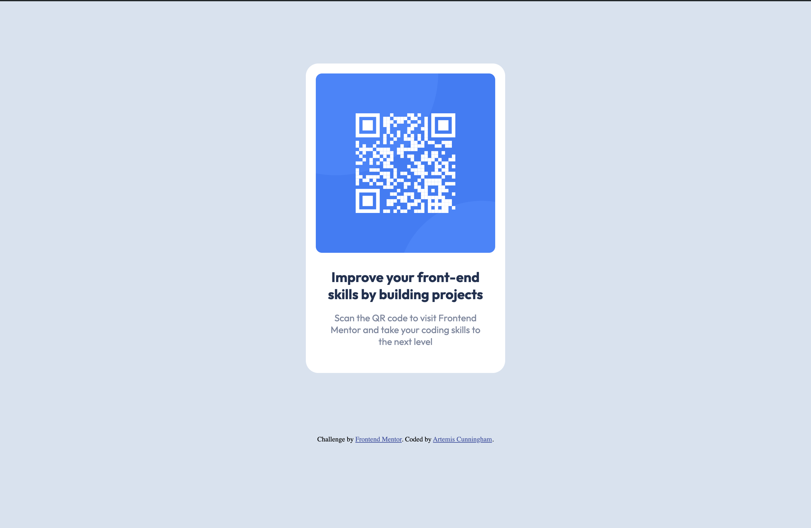

# Frontend Mentor - QR code component solution

This is a solution to the [QR code component challenge on Frontend Mentor](https://www.frontendmentor.io/challenges/qr-code-component-iux_sIO_H). Frontend Mentor challenges help you improve your coding skills by building realistic projects.

## Table of contents

- [Overview](#overview)
  - [Screenshot](#screenshot)
  - [Links](#links)
- [My process](#my-process)
  - [Built with](#built-with)
  - [What I learned](#what-i-learned)
  - [Continued development](#continued-development)
  - [Useful resources](#useful-resources)
- [Author](#author)

## Overview

### Screenshot



### Links

- Solution URL: [Add solution URL here](https://your-solution-url.com)
- Live Site URL: [Add live site URL here](https://your-live-site-url.com)

## My process

### Built with

- Semantic HTML5 markup
- CSS custom properties
- Flexbox

### What I learned

I learned how to use the :root pseudo-class element to make my code neater

```css
:root {
  background-color: hsl(212, 45%, 89%);
  --white: hsl(0, 0%, 100%);
  --gray-blue: hsl(220, 15%, 55%);
  --dark-blue: hsl(218, 44%, 22%);
  --light-gray: hsl(212, 45%, 89%);
}
```

### Continued development

I want to continue using the :root pseudo-class element as well

### Useful resources

- [MDN Web Docs](https://developer.mozilla.org/en-US/docs/Web/CSS) - This reference document from MDN Web Docs allowed me to further understand CSS and the different ways of styling a website.
- [Freecodecamp.org](https://www.freecodecamp.org/news/how-to-center-anything-with-css-align-a-div-text-and-more) - Freecodecamp.org has been the biggest help to me in completing challenges like this. It has a multitude of resources to help beginner and advanced coders.

## Author

- Github - [@outerspaceartie](https://github.com/outerspaceartie)
- Frontend Mentor - [@outerspaceartie](https://www.frontendmentor.io/profile/outerspaceartie)
